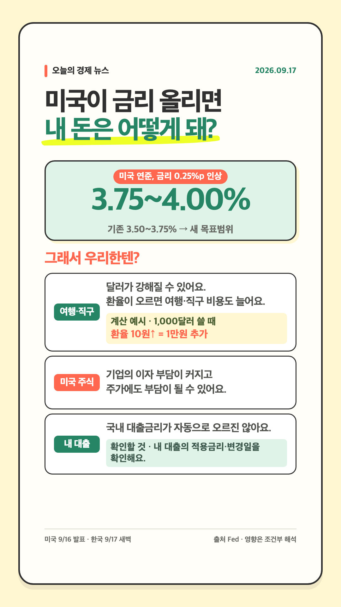

# Weekly Economy News Card Skill

공식 원문으로 확인한 경제·시장 이슈 가운데 대출, 저축, 지출, 투자, 일자리처럼 생활에 닿는 변화만 골라 한국어 인스타그램 스토리 카드로 만드는 Skill이다. 적합한 이슈 수에 따라 매회 **1~5장**을 만들며, 장수를 채우기 위한 기사는 넣지 않는다.



이 Fed 카드는 새 편집 기준과 코드 렌더러를 검증한 `sample_complete` 샘플이다. 한 주 전체를 완료한 기록은 아니며, 이전 3장 형식의 [2026년 9월 9~13일 예시](workflows/economy-news-cards/examples/2026-09-09_to_13/)도 역사 기록으로 보존한다.

## 들어 있는 것

- [실행 Skill](skills/weekly-economy-cards/SKILL.md): 기사 선정, 원문 검증, 1~5장 렌더링, 결과 패키징 규칙
- [시장 선정 기준](skills/weekly-economy-cards/references/market-selection.md): 생활 연결성과 새로움으로 후보를 고르는 기준
- [자체 포함 렌더러](skills/weekly-economy-cards/assets/renderer/): HTML/CSS/JavaScript와 Chrome Headless로 1080×1920 PNG 생성
- [전체 워크플로](workflows/economy-news-cards/workflow.md): 수요일 실행 범위, 중복 검사, 검수와 패키징
- [샘플과 디자인 기록](workflows/economy-news-cards/): 현재 1장 샘플과 기존 3장 샘플, 시각 체계와 실제 도구 기록

## 실행 기준

운영 시작 시각은 매주 수요일 20:00 KST다. 완료 주차 원장이 있으면 마지막 완료일 다음 날부터 7일인 가장 이른 미완료 수요일~화요일 주차를 선택한다. 밀린 주차를 합치거나 건너뛰지 않고 한 주씩 처리하며, 아직 끝나지 않은 주차나 미래 주차는 만들지 않는다. 완료 원장이 없을 때만 실행 시점 직전에 끝난 수요일~화요일을 선택해 원장에 기록한다. 정상적인 2026년 9월 23일 실행은 9월 16~22일을 조사한다. `sample_complete`와 부분 결과는 중복 검사에는 포함하지만 연속성 경계를 앞당기지 않는다.

기사 요약만 믿지 않고 발표기관의 원문 URL, 발표일과 사건일, 원문 시간대와 KST 환산일, 숫자·단위·비교 기준을 확인한다. 이전 실행과 샘플의 기록도 대조해 같은 사건을 반복하지 않는다.

## 설치와 렌더링

```bash
git clone https://github.com/mingeonho1/economic-news-card-skill.git
cp -R economic-news-card-skill/skills/weekly-economy-cards ~/.codex/skills/
```

Skill 폴더만 복사해도 레퍼런스와 렌더러가 함께 설치된다. 새 실행 폴더에서는 렌더러를 복사한 뒤 `data.js`의 `cards`에 1~5개 항목을 넣는다.

```bash
cp -R ~/.codex/skills/weekly-economy-cards/assets/renderer ./economy-card-render
cd economy-card-render
chmod +x render.sh
./render.sh
```

렌더 결과는 `weekly-economy-01.png`부터 실제 카드 수만큼 생성된다. 결과 폴더에는 PNG와 함께 `data.js`, `sources.md`, `provenance.md`, `manifest.json`을 남기고 필요하면 ZIP으로 묶는다.

수요일 20:00은 제작 시작 시각이다. 선택된 전달 경로는 카카오톡 `나에게 보내기`지만, 인증 정보는 연결하지 않았고 실제 전송도 활성화하지 않았다. 연결 시 지켜야 할 경계는 [전달 계약](workflows/economy-news-cards/automation/delivery.md)에 적는다.

현재 Fed 샘플은 HTML/CSS/JavaScript와 Chrome Headless로 만들었고 GPT Image는 사용하지 않았다. 새 삽화가 꼭 필요할 때만 이미지 생성을 선택적으로 쓰며, 실제 모델과 도구 식별자는 실행 환경이 노출한 값만 [제작 기록](workflows/economy-news-cards/model-and-tooling.md)에 남긴다.
