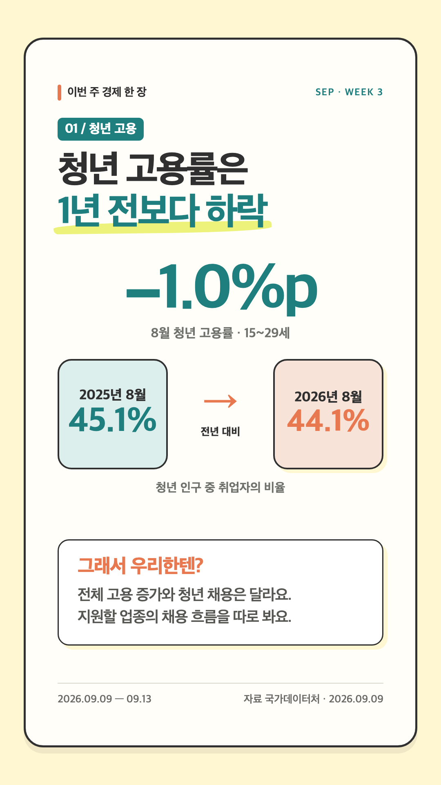

# 경제 뉴스 카드 제작

**왜 만들었나:** 매주 바뀌는 경제 뉴스를 AI가 읽기 쉬운 스토리 카드로 만들되, 숫자와 출처가 틀리지 않게 반복하기 위해서다.

매주 경제·주식·금융 뉴스 3개를 인스타그램 스토리용 PNG로 만든다. 뉴스 하나당 한 장이며, 핵심 수치 하나와 `그래서 우리한텐?` 해석을 1~2줄로 넣는다.

## 실제 루틴

1. 웹에서 후보 5~8개를 찾고, 발표기관의 원문으로 수치·기간·단위·비교 기준을 확인한다.
2. 사실은 제목에, 조건부 생활/투자 영향은 `그래서 우리한텐?`에 분리한다.
3. **카드 비주얼 생성은 GPT Image의 기본 내장 경로**를 쓴다. 두 개의 실제 인포그래픽 레퍼런스에서 제목-수치-설명 순서와 색의 역할을 추출해 프롬프트와 레이아웃 규칙으로 바꿨다.
4. 출력 이미지를 직접 보고 한글 가독성, 수치, 카드 간 일관성을 검수한다. 이미지 모델이 숫자·날짜를 흔들면 검증된 문구로 다시 생성하거나 템플릿 렌더링을 보조로 쓴다.
5. PNG 3장, `sources.md`, 입력 데이터, 생성 기록을 `runs/YYYY-MM-DD/`에 저장하고 ZIP으로 묶어 알림에 첨부한다.

## 사용한 Skill·훅

| 구분 | 사용 방식 |
| --- | --- |
| `imagegen` | 기본 내장 GPT Image로 레퍼런스 기반 카드 비주얼 생성·수정 |
| `weekly-economy-cards` | 주차 계산, 기사 선택, 출처 검증, 카드 문장, 파일 패키징을 고정 |
| 주간 자동화 훅 | 일요일 20:00 KST 실행, 직전 카드 종료일 다음 날부터 수집, 색상 순환 |
| 시각 검수 | PNG를 직접 확인해 정보 우선순위와 한글 가독성 판단 |

## 모델과 경계

GPT Image의 실제 사용 모델 ID는 내장 도구가 노출할 때만 생성 기록에 남긴다. 이 프로젝트는 추정 모델명을 지어 쓰지 않는다. GPT Image가 카드의 시각적 완성도와 레퍼런스 반영을 담당하고, 원문 수치 검증은 이미지 생성과 독립된 단계로 남긴다.

OpenAI 공식 문서의 [이미지 생성 개요](https://developers.openai.com/api/docs/guides/image-generation), [GPT Image 모델 문서](https://developers.openai.com/api/docs/models/gpt-image-2.5-sunburst), [Images API 생성 레퍼런스](https://developers.openai.com/api/reference/cli/resources/images/methods/generate)를 모델 선택·이미지 생성·파라미터 이해에 참고했다.

## 폴더

- [실행 Skill](../../skills/weekly-economy-cards/SKILL.md)
- [주간 자동화 훅](automation/weekly-hook.md)
- [디자인 결정](design-decisions.md)
- [검증·패키징 흐름](workflow.md)
- [9월 9–13일 예시 카드·출처·ZIP](examples/2026-09-09_to_13/)
- [템플릿 렌더러](template/): GPT Image 결과에 정확한 수치 레이어가 필요할 때의 보조 경로

